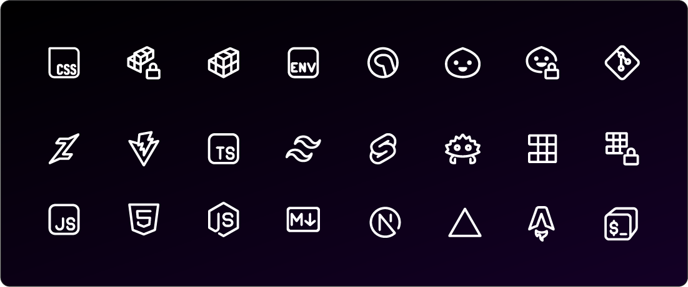

<p align="center">
  <br/>
  <h4 align="center"><strong><code>Fificons</code></strong> - An aesthetic icons font for developers</h4>
</p>

<h6 align="center">

[Introduction](/#-introduction) · [Usage](/#-usage) · [Contribute][github-issues-link]

</h6>

<div align="center">

[![][github-stars-badge]][github-stars-link]
[![][github-issues-badge]][github-issues-link]
[![][github-contributors-badge]][github-contributors-link]
[![][github-forks-badge]][github-forks-link]
[![][github-license-badge]][github-license-link]<br>

</div>

## ✨ Introduction

[**`Fificons`**](/) is an aesthetic and minimalist icons font 🎨, specifically designed for developers who seek a clean and modern look in their terminals and development environments.

## 🎨 Preview


## 🍁 Usage
### Installation

Download the Font from
[the latest GitHub release](https://github.com/Fifixex/fificons/releases/latest).
Open the downloaded font file and click to "**Install**".

### Configuration
<details>
<summary>🖥️ Windows Terminal</summary>
&nbsp;

- *Manual* : Open the **Windows Terminal** settings file (`settings.json`).
```json
{
  "profiles":
    {
        "defaults":
        {
            "font":
            {
                "face": "Fira Code Retina, Fificons",
                "size": 12
            },
        },
    }
}
```
</details>
<details>
  <summary>🦀 Warp</summary>
  soon
</details>
<details>
  <summary>🌺 Alacritty</summary>
  soon
</details>


## 🤝 Contributing

We welcome contributions of all kinds! Whether you're interested in reporting issues, submitting feature requests, or improving the code, we encourage you to get involved. Feel free to explore our GitHub [Issues][github-issues-link] to see where you can help.

> \[!NOTE]
> We believe in creating a community-driven project where knowledge is shared, ideas are exchanged, and collaboration leads to innovation.
> Your contributions, whether it's product feedback, design suggestions, or bug fixes, are essential in making **Fifiicons** even better.

**Principal Maintainers:** [@fifixex](https://github.com/Fifixex)


<p align="center">
	Copyright &copy; 2024-present <a href="https://github.com/Fifixex/fificons" target="_blank">Fificons</a>
</p>

[github-stars-link]: https://github.com/Fifixex/fificons/network/stargazers
[github-stars-badge]: https://img.shields.io/github/stars/Fifixex/fificons?color=ff99c8&labelColor=black&style=flat-square
[github-license-link]: https://github.com/Fifixex/fificons/blob/master/LICENSE
[github-license-badge]: https://img.shields.io/badge/license-MIT-white?color=fcf6bd&labelColor=black&style=flat-square
[github-forks-link]: https://github.com/Fifixex/fificons/network/members
[github-forks-badge]: https://img.shields.io/github/forks/Fifixex/fificons?color=d0f4de&labelColor=black&style=flat-square
[github-issues-link]: https://github.com/Fifixex/fificons/issues
[github-issues-badge]: https://img.shields.io/github/issues/Fifixex/fificons?color=a9def9&labelColor=black&style=flat-square
[github-contributors-link]: https://github.com/Fifixex/fificons/graphs/contributors
[github-contributors-badge]: https://img.shields.io/github/contributors/Fifixex/fificons?color=e4c1f9&labelColor=black&style=flat-square
